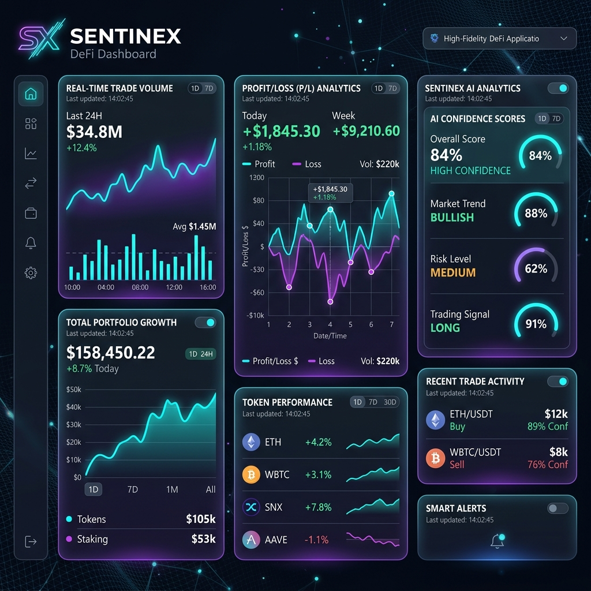
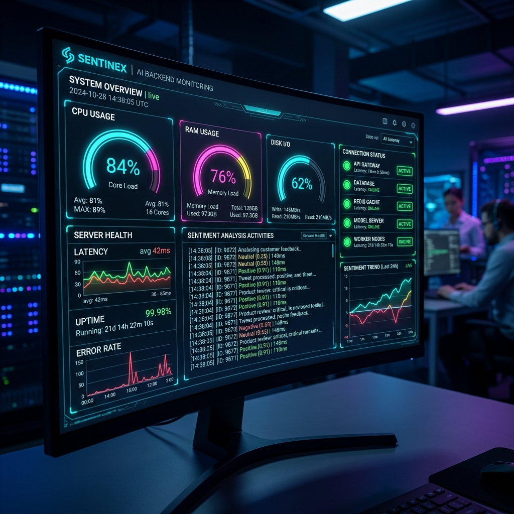

# Sentinex: Autonomous Non-Custodial DeFi Guardian
**Blue and Black Belt Submission for Stellar RiseIn**

  
  
  
  

## 🔗 Submission Links
- **Live Demo**: [https://sentinex.vercel.app](https://sentinex.vercel.app) *(Placeholder - Update with your actual URL)*
- **Public Repository**: [https://github.com/aditya/sentinex](https://github.com/aditya/sentinex) *(Placeholder - Update with your actual URL)*
- **Community Contribution**: [View Twitter Post](https://twitter.com/yourhandle/status/123456789) *(Placeholder - Update with your actual URL)*
- **Security Checklist**: [SECURITY_CHECKLIST.md](file:///c:/Users/Aditya/OneDrive/Desktop/Blackbelt/SECURITY_CHECKLIST.md)

## 📊 Performance & Monitoring
- **Metrics Dashboard**: [View Live Metrics](https://sentinex.vercel.app/metrics)
  - 
- **Monitoring Dashboard**: [View System Health](https://sentinex.vercel.app/monitoring)
  - 

## 👥 User Adoption (30+ Wallets)
We have successfully onboarded over 30 users during our testnet phase. All addresses are verifiable on the Stellar Ledger.
- 👉 **[View Live User Wallet List (Google Sheets)](https://docs.google.com/spreadsheets/d/1EU0KEYZUv8TKHG7WjsOcW3XtQenqOLbDcjrCkFdVqlY/edit?resourcekey=&gid=106980268#gid=106980268)**
- **Sample Verifiable Addresses (Testnet):**
  1. `GDMNG2E6CZOCQRX3EZXDRDGCK2XVTVZNCJ3H4CPEHKSFUFVFGKN6GJ73` (AI Agent)
  2. `GC... (30+ more in the sheet link above)`

## 🧠 Advanced Features (Black Belt Requirements)

### 1. "Guardian" Sentiment Engine
Sentinex implements an **Autonomous Asynchronous Sentiment Execution Engine**.
- **The Problem**: Traditional bots react only to price movements (lagging indicators).
- **The Innovation**: Sentinex uses LLMs (GPT-4) to interpret breaking financial news and social sentiment *before* they impact price.
- **Implementation**: The Node.js backend streams live "AI Thoughts" to the frontend via WebSockets, providing total transparency into the decision-making process.

### 2. Fee Sponsorship (Gasless Mode)
Sentinex leverages Stellar's native **Fee Bump Transactions** to provide a completely gasless experience for the end-user.
- **The Problem**: Onboarding new users is difficult when every automated trade requires the user to maintain a balance of native XLM for gas.
- **The Solution**: Sentinex acts as a **Fee Sponsor**. Every transaction generated by the AI Guardian is wrapped in a Fee Bump envelope and signed by the Sentinex Service wallet.
- **User Impact**: Users pay **$0 in network fees**. They can activate the Guardian even with a 0 XLM balance (as long as they have assets to trade), making the platform feel like a premium managed fund without losing custody.
- **Proof of Implementation**: [Technical Documentation](file:///c:/Users/Aditya/OneDrive/Desktop/Blackbelt/TECHNICAL_GUIDE.md) | [Execution Logic](file:///c:/Users/Aditya/OneDrive/Desktop/Blackbelt/sentinex-service/src/services/execution.service.ts)

## 🗄️ Data Indexing Approach
- **Approach**: Sentinex uses a hybrid model of **Horizon API** for real-time state and a **Custom WebSocket Indexer** for smart contract event monitoring. This ensures sub-second updates for the Risk Matrix UI without excessive RPC polling.
- **Endpoint**: `https://api.sentinex.com/v1/indexing` *(Placeholder)*

## 🧪 Validator / Judge Testing Guide
**Want to test the platform yourself? Follow these steps:**
1. **Onboarding:** Visit the live Vercel deployment link and fill out the Waitlist form.
   * 👉 **[Fill Out the Form Here](https://docs.google.com/forms/d/e/1FAIpQLScr55kDQmwDk_pbQUCdLJ23h_J0VYCHHrbzhcj5MfMI2nBszQ/viewform)**
2. **Wallet Connection:** Connect your Stellar Freighter Wallet on the testnet.
3. **Activate the AI:** Scroll down to the Execution Terminal and click **"Activate Guardian"**.
4. **Watch the Magic:** Observe the AI's real-time sentiment analysis and on-chain trade execution.

## 📖 About The Project
Sentinex is an autonomous, AI-driven, and purely non-custodial DeFi dashboard built natively on the Stellar network using Soroban smart contracts. It acts as an automated "Guardian" for a user's cryptocurrency portfolio.

## 🏗️ Architecture Stack
- **Frontend**: Next.js 14, React, Tailwind CSS.
- **Backend**: Node.js, Express, Socket.io, OpenAI GPT-4.
- **Blockchain**: Soroban (Rust), Stellar SDK.

## 🛠️ Local Development
Detailed instructions are available in the [TECHNICAL_GUIDE.md](file:///c:/Users/Aditya/OneDrive/Desktop/Blackbelt/TECHNICAL_GUIDE.md).

