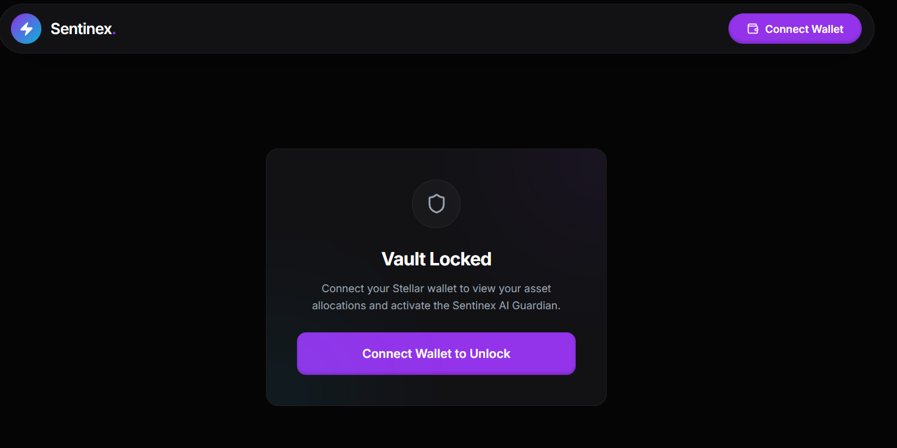
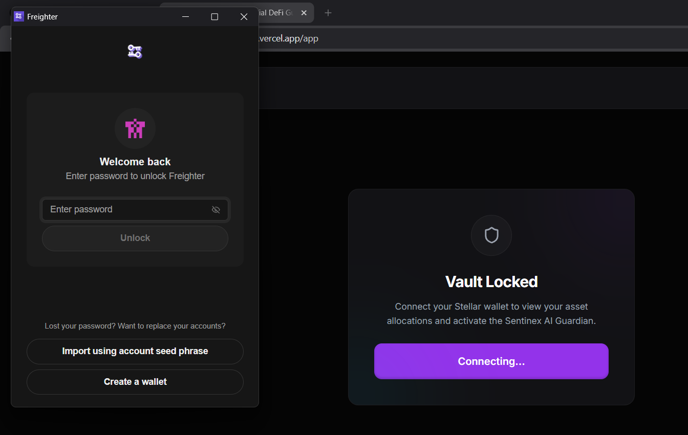
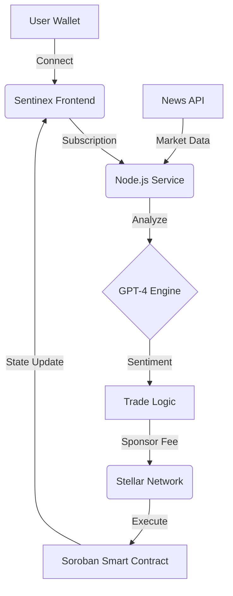

# Sentinex: Autonomous Non-Custodial DeFi Guardian

Sentinex is an AI-driven, non-custodial portfolio management platform built on the Stellar network. It utilizes Soroban smart contracts and advanced sentiment analysis to provide autonomous trading capabilities while ensuring the user maintains full control of their assets.

## Submission Links

- **Live Demo**: [https://sentinex.vercel.app](https://sentinex.vercel.app)
- **Public Repository**: [https://github.com/Aditya-linux/Blackbelt-stellar](https://github.com/Aditya-linux/Blackbelt-stellar)
- **Community Contribution**: [View Twitter Post](https://x.com/AdityaNishad987/status/2048324593925214274?s=20)
- **Security Checklist**: [SECURITY_CHECKLIST.md](./SECURITY_CHECKLIST.md)

## Project Video Demonstration

A complete walk-through of the project, including the AI Guardian's autonomous execution and the gasless transaction flow, can be viewed here:
[Sentinex Live Demonstration](https://drive.google.com/file/d/145_sf_IuvmY5kczD4xFAvES5ZItmohL1/view?usp=sharing)

## Core Features

- **Autonomous Sentiment Engine**: Real-time analysis of market news using GPT-4 to drive trading decisions.
- **Gasless Transactions**: Stellar Fee Bumps are utilized to sponsor network fees for all automated trades.
- **Non-Custodial Security**: Funds remain in the user's control through secure Soroban smart contracts.
- **Real-Time Monitoring**: Live terminal feedback and sentiment streaming via WebSockets.

---

## User Experience

### 1. Seamless Onboarding
The platform integrates with the Freighter wallet to provide a secure and simple connection process. Users can quickly link their Stellar accounts and prepare their vault for the AI Guardian.

### 2. Live Market Intelligence
Sentinex continuously monitors financial news sources. The sentiment engine processes these feeds to identify market trends before they manifest in price movements.

---

## User Adoption and Feedback

Sentinex has successfully onboarded a growing community of users during its testnet phase. We prioritize user experience and actively collect feedback to refine the AI Guardian's logic and the platform's interface.

- **Waitlist and Feedback Form**: [Fill out the survey](https://docs.google.com/forms/d/e/1FAIpQLScr55kDQmwDk_pbQUCdLJ23h_J0VYCHHrbzhcj5MfMI2nBszQ/viewform)
- **Live User Adoption Tracking**: [View onboarded wallets and feedback](https://docs.google.com/spreadsheets/d/1EU0KEYZUv8TKHG7WjsOcW3XtQenqOLbDcjrCkFdVqlY/edit?resourcekey=&gid=106980268#gid=106980268)

---

## System Architecture

The following diagram illustrates the flow of data and execution within the Sentinex ecosystem.

---

## Advanced Capabilities

### Guardian Sentiment Engine
The Guardian engine replaces traditional price-action bots with a sentiment-first approach. By interpreting the intent and context of breaking news, the platform can position portfolios ahead of significant market shifts.

### Stellar Fee Sponsorship
To reduce the barrier to entry, Sentinex implements Stellar's native Fee Bump transactions. This allows the platform to sponsor the XLM costs for transactions, providing a frictionless experience where users do not need to manage gas balances for automated operations.

---

## Technical Stack

- **Frontend**: Next.js 14, React, Tailwind CSS
- **Backend**: Node.js, TypeScript, OpenAI GPT-4
- **Blockchain**: Soroban (Rust), Stellar SDK
- **Communication**: Socket.io for real-time data streaming

---

## Documentation Links

- [Technical Guide](./TECHNICAL_GUIDE.md)
- [Security Checklist](./SECURITY_CHECKLIST.md)
- [User Manual](./USER_GUIDE.md)
